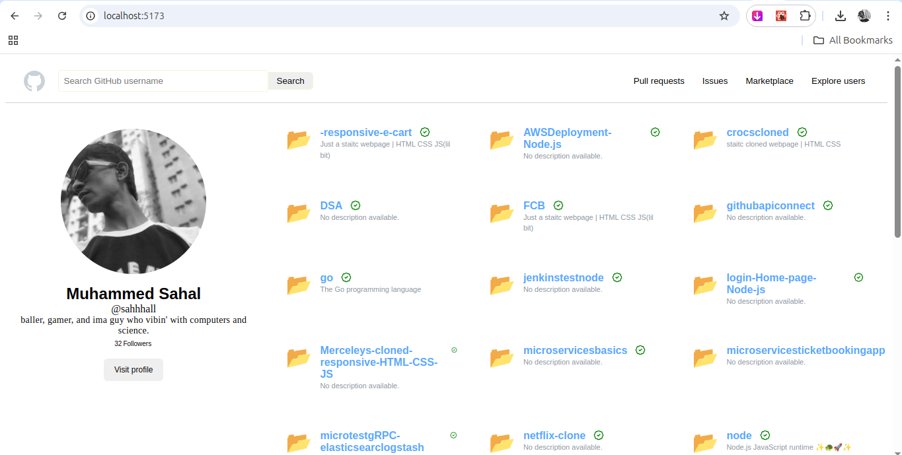
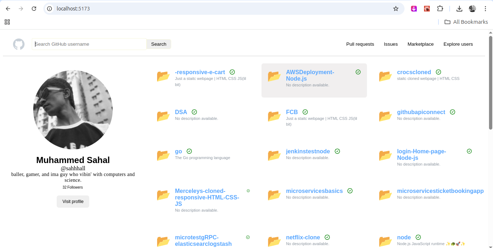
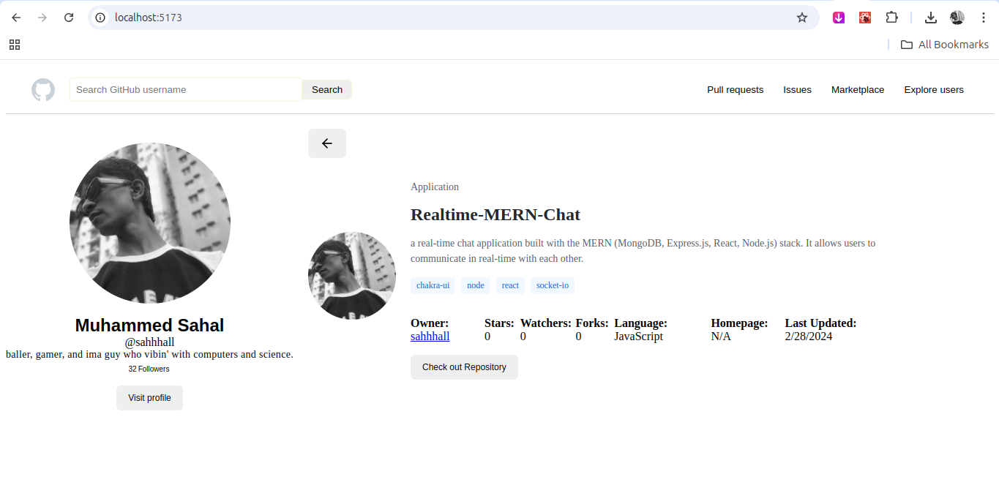
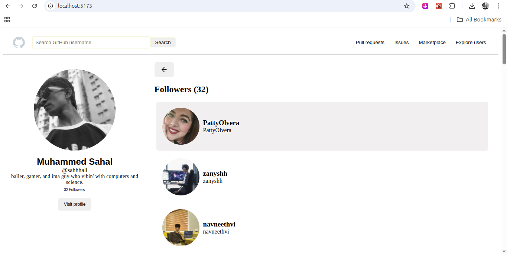
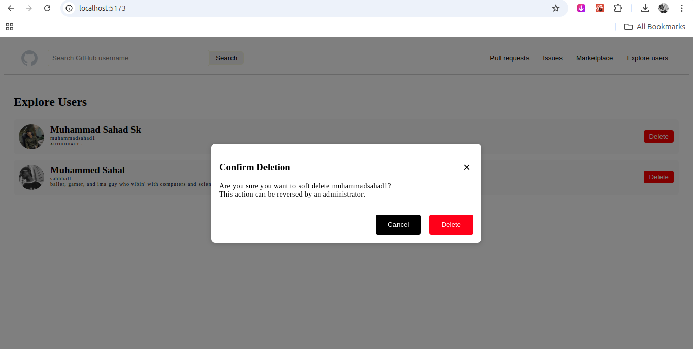

# UI Guide for GitHub User Search App

## Home Page
- Users can enter a GitHub username.
- Clicking "Search" fetches data from the backend.

## User Profile Page
- Displays user details (avatar, username, bio).
- Lists repositories fetched from the API.

## Repository Details Page
- Clicking a repository shows its description.

## Followers Page
- Clicking "View Followers" lists all followers.

## Delete User
- Clicking "Expolres" lists all users.

## Navigation Flow
- Users can go back to the search page anytime.

---

## Notes
- The UI follows a minimal design without CSS frameworks.
- All API calls avoid redundancy (cached results where possible).
